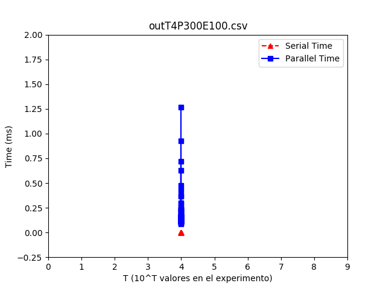
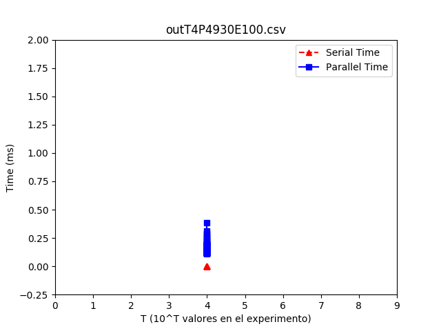
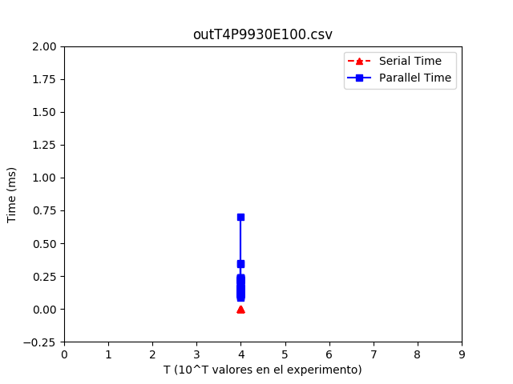
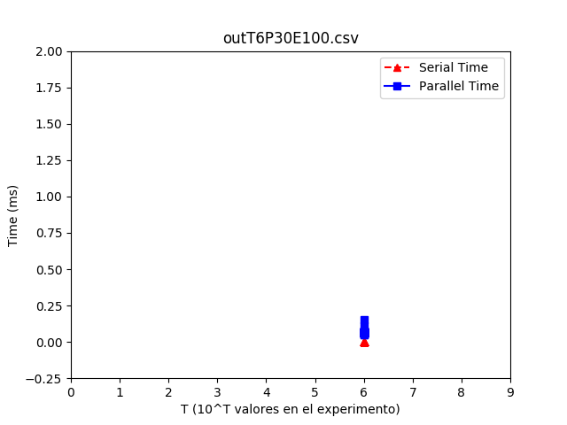
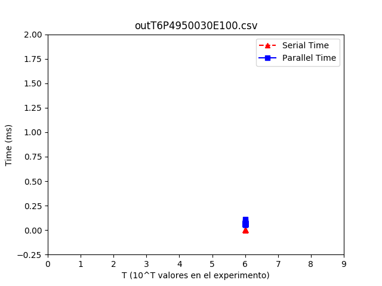
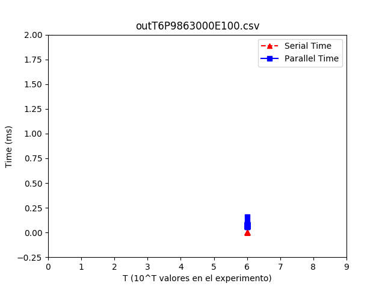
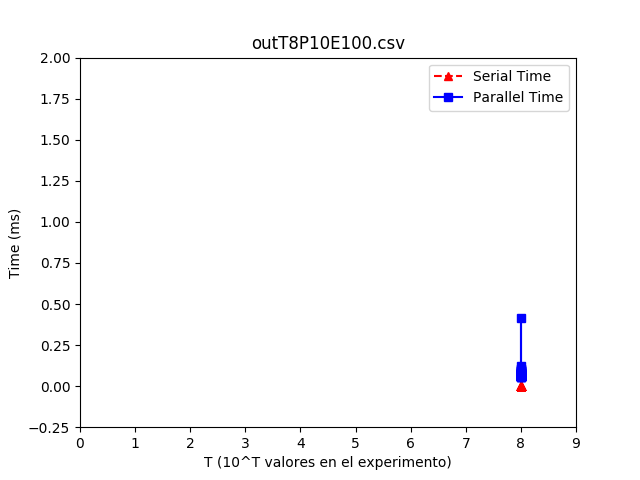
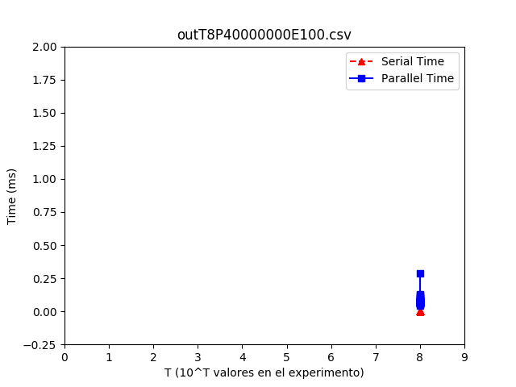
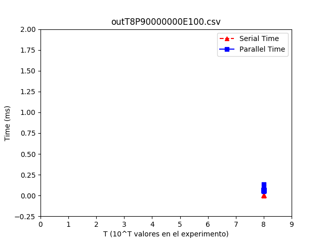

INTEGRANTES:

-Pedro Grand

-Raimundo Marin

ALGORITMO PARALLEL BINSEARCH:

El algoritmo que se usó en esta tarea consistió en dividir el arreglo en partes íguales dependiendo de la cantidad de núcleos que tuviese el hardware. Después utilizamos la misma cantidad de threads que núcleos disponibles en la CPU y entregarle por medio de threads un pedazo igual del arreglo a cada uno.

pseudo-codigo parallel.

    parallel_binsearch(arr[], min, max, posicion)
        max_threads
        arr_threads[max_threads]
        c_parts = max / max_threads
        mult = 1
        min = 0
        for (int i = 0; i < max_threads; i++)
            if (thread_create(binsearch(arr[],min, c_parts*mult, posicion))
                continue
            min = c_parts * mult
            mult++

para esto necesitamos la funcion serial.

    binsearch(arr[], min, max, posicion)
        low = min
        high = max - min
        while (low < high && !finish)
            mid = (low + high) / 2
            if (posicion < mid)
                high = mid - 1
            elif(x > mid)
                low = mid + 1
            else
                finish = 1
            exit(thread)
        return 0

se ve claramente como la funcion paralela llama a la serial entregandole el pedazo que le corresponde.

ANALISIS DE RESULTADOS:

1.Grafico T4 P300 E100

2.Grafico T4 P4930 E100

3.Grafico T4 P9930 E 100

4.Grafico T6 P30 E100

5.Grafico T6 P4950030 E100

6.Grafico T6 P9863000 E100

7.Grafico T8 P10 E100

8.Grafico T8 P40000000 E100

9.Grafico T8 P90000000 E100

Como se puede ver en los graficos el binserach serial se demora menos que el parallel binsearch, esto se debe a los context switch, ya que al cambiar de thread se necesita realizar una serie de instrucciones para poder empezar a trabajar y esto, claramente toma tiempo de nuestra preciada CPU.
En conclución, aunque el paralelismo puede ser muy útil implementarlo, no siempre es bueno usarlo.

PROBLEMAS ENCONTRADOS Y LIMIATICIONES:

Se encontró un problema cuando T > 6 donde se generaba un Core Dumped, debido a un mal manejo de memoria, después Claudio en el foro nos explicó como arreglar este error.

Tuvimos un problema con el flag -std=c11 que no nos dejaba compliar con el nuevo clock que el profesor dijo que debíamos utilizar ya que el otro media tiempo en CPU en el programa, para esto tuvimos que cambiar el flag por -std=gnu11 para poder compilar.
