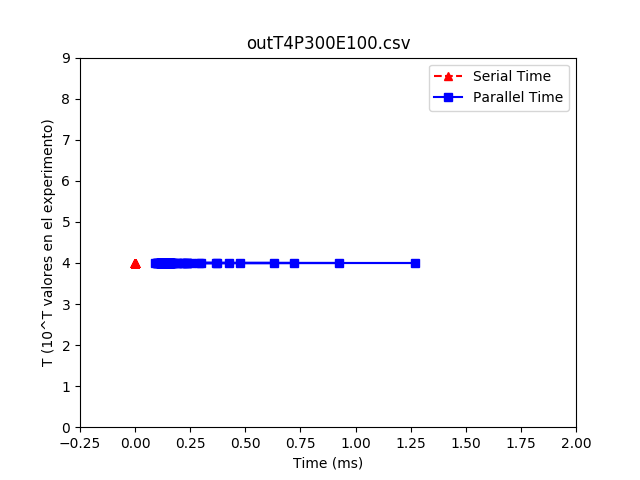
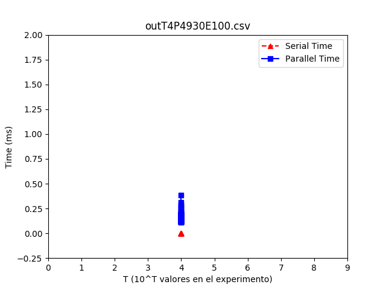
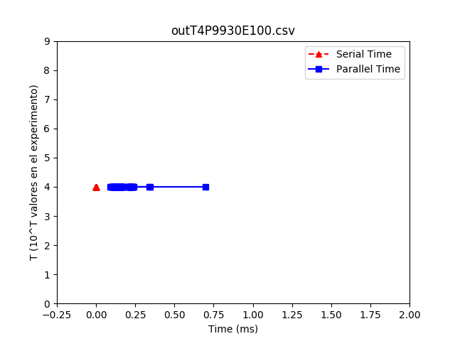
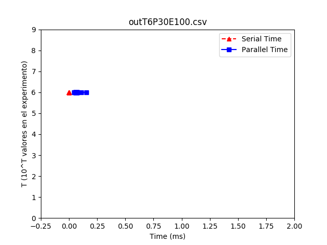
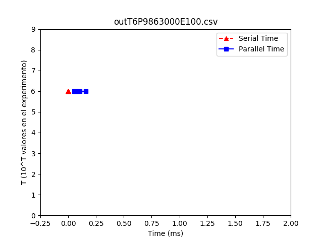
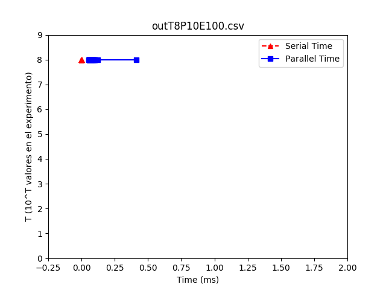
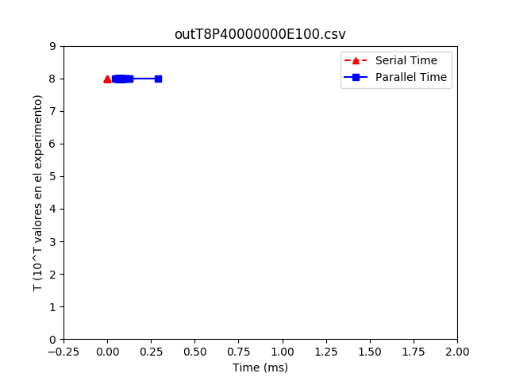
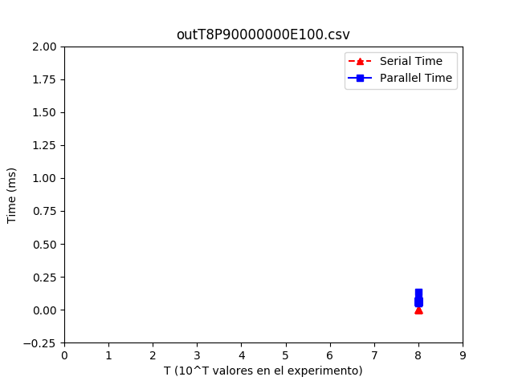

INTEGRANTES:

-Pedro Grand

-Raimundo Marin

ALGORITMO PARALLEL BINSEARCH:

el algoritmo que se uso en la tarea consistio en dividir el arreglo en partes iguales dependiendo la cantidad de nucleos que tuviese el hardware. despues utilizamos la misma cantidad de threads que los nucleos que se pueden usar y dentro de cada thread llamaos la funcion serial, pero con un pedazo del arreglo original.

pseudo-codigo parallel.

    parallel_binsearch(arr[], min, max, posicion)
        max_threads
        arr_threads[max_threads]
        c_parts = max / max_threads
        mult = 1
        min = 0
        for (int i = 0; i < max_threads; i++)
            if (thread_create(binsearch(arr[],min, c_parts*mult, posicion))
                continue
            min = c_parts * mult
            mult++

para esto necesitamos la funcion serial.

    binsearch(arr[], min, max, posicion)
        low = min
        high = max - min
        while (low < high && !finish)
            mid = (low + high) / 2
            if (posicion < mid)
                high = mid - 1
            elif(x > mid)
                low = mid + 1
            else
                finish = 1
            exit(thread)
        return 0

se ve claramente como la funcion llama a la funcion serial para buscar en el arreglo la posicion.

ANALISIS DE RESULTADOS:

1.Grafico T4PE100

2.Grafico T4PE100

3.Grafico T4PE100

4.Grafico T6PE100

5.Grafico T6PE100

6.Grafico T6PE100

7.Grafico T8PE100

8.Grafico T8PE100

9.Grafico T48PE100

Como se puede ver en los graficos el binserach serial se demora menos que el parallel binsearch por los context switch, ya que al cambiar de thread se necesita cargar los registros y esto requiere tiempo en la CPU.
Para este algoritmo no es conveniente hacerlo en paralelo porque su rendimentto es menor que el binsearch serial.

PROBLEMAS ENCONTRADOS Y LIMIATICIONES:

se econtro un problema cuando T > 6 donde se terminaba repentinamente el programa por un segmentation Core dumped por un mal manejo de memoria, despues Claudio nos dio un tip para solucionar este error.

Tuvimos un problema con el flag std=c11 que no nos dejaba compliar con el nuevo clock que el profesor dijo que debiamos utilizar ya que el otro media tiempo en CPU en el programa, para esto tuvimos que cambiar el flag por std=gnu11 y asi nos compilo correctamente y funciono el codigo sin ninguna interrupcion.
